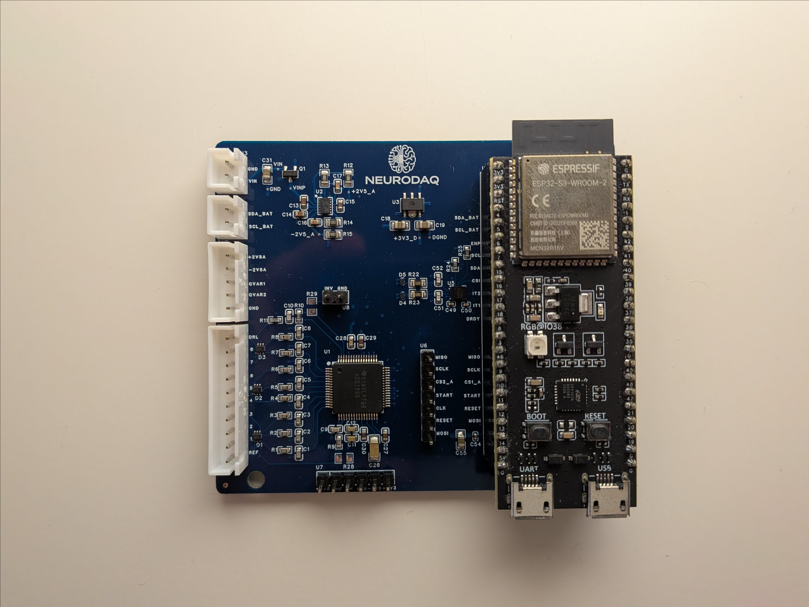
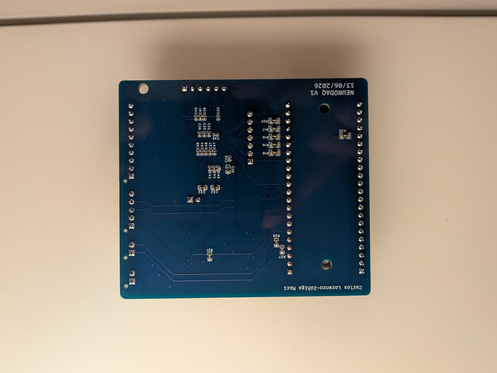

# neurodaq-hardware

PCBs and mechanical parts for [NeuroDAQ](https://github.com/carlos-lorenzo/neurodaq) —
an open 8-channel wearable EEG headset. Designed in **EasyEDA**; gerbers, drill files,
BOMs and 3D models are committed here, so **both boards are orderable as-is**.

## Boards

### Main carrier (`PCB/main/`)

The analog front-end and MCU carrier. **4-layer** (inner layers present in the gerber
set).

- **ADS1299IPAGR** — 8-channel 24-bit EEG AFE.
- **LM27762** — ±2.5 V analog rails for the AFE.
- **XC6220** — 3.3 V digital rail.
- **LSM6DSV16X** — 6-axis IMU with QVAR (electrostatic sensing).
- Per-channel **2.2 kΩ / 1 nF RC** + ESD protection on each electrode input.
- **DRL / bias drive** for common-mode rejection.
- An **ESP32-S3-DevKitC-1-N8R2** plugs into 2×22 headers — it is *not* soldered, which
  is why no MCU appears in the BOM.
- `CS2_ADC` / GPIO21 is routed for a **second cascaded ADS1299** that is not populated
  (BOM qty 1) and not driven by firmware.

### Breakout (`PCB/breakout/`)

Passive electrode breakout, **2-layer**, top-side assembly only. Brings out E1–E8, REF,
QVAR×2 and GND to two JST XH connectors (10-way + 5-way) that cable to the carrier.

## What's in each PCB folder

| File / dir | Contents |
|---|---|
| `gerbers/` | Gerbers, `.DRL` drill files, flying-probe test JSON, `How-to-order-PCB.txt` |
| `SCH_*.pdf` | Schematic export |
| `BOM_*.xlsx` | Bill of materials |
| `P1.dxf` | Board outline |
| `<board>_3d/` | `.obj` + `.mtl` 3D board model |

> `gerbers/` (EasyEDA's export folder); it is the gerber
> set. To order, follow `How-to-order-PCB.txt` or upload the folder to any fab.

## Mechanical / enclosure

A size-adjustable 3D-printed headset. Author-designed electronics enclosure plus band
and electrode parts adapted from the OpenBCI Ultracortex Mark IV (see Attribution).

| Part | Files | Origin |
|---|---|---|
| `frame_front`, `frame_back_side`, `frame_bottom`, `frame_lid` | DWG + STEP + STL | **Author-designed** electronics enclosure |
| `M4_{Small,Medium,Large}_{Front,Back}`,  | STL | Ultracortex Mark IV |
| `electrode_screw` | DWG + STEP + STL | Ultracortex Mark IV, **modified**: adds studs to melt over and secure a snap connector |

The file-format split is provenance, not oversight: author-designed parts ship editable
DWG + STEP + STL; Mark IV-derived parts are STL-only because that is how they were
obtained.

## Attribution — OpenBCI Ultracortex Mark IV

The band parts (`M4_*`), the wire clip, and the electrode holder derive from the
[OpenBCI Ultracortex Mark IV](https://github.com/OpenBCI/Ultracortex). And are licenced under GPLv3. The relevant files are inside `OpenBCI` subdirectories.

## Still pending

The editable **EasyEDA project export** (`.epro` / JSON) is the one remaining gap.
Everything needed to *fabricate* is here; what's missing is what you'd need to *modify*
the schematic/layout. Will upload soon. For now here's the [link]( https://oshwlab.com/clorzui/project_mbmhksrb).

## Licence

MIT for the boards and author-designed parts — **except** the OpenBCI-derived
mechanical parts; see [Attribution](#attribution--openbci-ultracortex-mark-iv).
